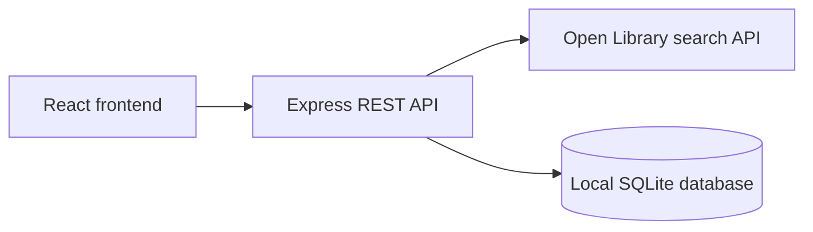

# Reading List Tracker — design for review

Status: proposed written design; awaiting review before implementation.

## Outcome and boundaries

Build a small application for discovering books and maintaining one personal
reading list. A reviewer must be able to run it from the README, demonstrate
search/save/view/update/remove, and restart the backend without losing data.
The candidate must be able to explain the submitted code and tradeoffs during
a 15-minute presentation and 15-minute Q&A.

Use React, TypeScript, Node.js, Express, and SQLite. Use `.tsx` for React
components and `.ts` for backend code, shared contracts, and tests. Use Vite for
frontend development/builds, TypeScript for static type checking, and ESLint for
linting. Target Node.js 24.12 or newer and TypeScript 5.8 or newer; verify the
documented minimum runtime during implementation. Use Node's built-in type
stripping, SQLite driver, and test runner to reduce dependencies; disclose the
SQLite driver's stability status for the selected Node version.

Budget: 4–6 hours including verification and handoff. The mandatory checklist in
`docs/assessment-checklist.md` is the acceptance contract. Tests and pagination
are selected enhancements. A small search cache and CI are included only if time
remains. Authentication, multiple users, Docker, and hosting are deferred.

## Architecture

- `client/`: React components, backend request helper, and CSS.
- `server/app.ts`: Express composition, API fallback, and HTTP error mapping;
  an app factory accepts a store and book-search function for integration tests.
- `server/books/routes.ts`: book search and saved-list endpoints.
- `server/books/validation.ts`: boundary validation middleware using shared schemas.
- `server/books/open-library.ts`: external requests, normalization, timeout handling,
  and optional bounded search caching.
- `server/books/store.ts`: schema initialization and explicit list/add/update/delete
  functions using prepared statements.
- `server/index.ts`: configuration, database path, listener, static frontend
  serving, and graceful shutdown.
- `shared/books.ts`: status values, labels, Zod schemas, and inferred book/input/
  response types; no generic service or repository framework.
- `server/books/*.test.ts`: colocated Node integration tests with an ephemeral
  HTTP listener, temporary database, and controlled external API responses.

In development, Vite proxies `/api` to Express. After a production build, Express
serves the frontend and API from one origin. Neither frontend JavaScript nor
image elements request data from Open Library directly. Cover images are outside
the initial scope; title, author, and publication year provide meaningful detail.

## Tao of Node considerations

Applied guidance from [Alex Kondov's Tao of Node](https://alexkondov.com/tao-of-node/):
domain grouping, thin HTTP handlers, validation middleware, centralized errors,
function-based dependencies, integration tests, reproducible dependencies, and
graceful shutdown. Use one schema validator for the request shapes above. Storage
returns application objects, keeping SQLite column names and JSON parsing internal.
Validate configuration once during startup. Use structured diagnostic output;
an uncaught fatal error ends the process rather than continuing in unknown state.
Pin dependency versions and commit the lockfile for reproducible `npm ci` installs.

Our scope choices: use TypeScript, prepared SQL, and synchronous SQLite for
short local operations. Document event-loop blocking as a scaling limitation.
A query builder, containers, and API versioning can be reconsidered
when their concrete benefit warrants the cost. These are contextual decisions,
not claims of following every recommendation.

## TypeScript and validation

Enable `strict: true` in both frontend and backend configurations. Keep two small
configs: frontend JSX and bundler resolution in `tsconfig.client.json`; NodeNext
resolution and erasable syntax in `tsconfig.server.json`. Both include the shared
contracts. Run `tsc --noEmit` for each in the local check command and CI. Vite
transpilation and Node type stripping do not replace that check.

Execute server/test `.ts` files directly with Node; Vite handles `.tsx`. Use
explicit relative import extensions, `import type` for type-only dependencies,
and `erasableSyntaxOnly` for backend code. Avoid runtime enums, decorators, and
parameter properties. Do not add a backend bundler or runtime TypeScript runner
when Node's built-in support meets the requirement.

Use Zod as the one schema validator and infer types with `z.infer` rather than
maintaining duplicate request definitions. Model `ReadingStatus` from its allowed
values and derive book, saved-book, and response types from their schemas. Parse
unknown request/upstream data before using it; validate frontend API responses
with the shared schemas instead of asserting that arbitrary JSON is a book.
Static types complement runtime validation and SQLite constraints.

Apply the relevant [TypeScript handbook guidance](https://www.typescriptlang.org/docs/handbook/declaration-files/do-s-and-don-ts.html):

- Use primitive `string`, `number`, and `boolean` types, not boxed object types.
- Use `unknown` at untrusted boundaries and narrow it; avoid application `any`.
- Prefer simple unions and genuine optional parameters to unnecessary overloads.
- Every generic parameter must contribute to the type contract.
- Use `void` for callbacks whose return value is ignored; optional callback
  parameters mean the caller can actually omit them.

The linked page concerns declaration files; apply its relevant type-contract
rules here without creating custom `.d.ts` infrastructure. Prefer inference for
local values and small explicit types for module boundaries. No compiler-error
suppression or unchecked response casts to make a failing check pass.

## Data and integrity

One `saved_books` table stores an integer primary key, unique Open Library work
ID, title, authors as a JSON array in a text column, optional first publication
year, status, notes, and UTC creation/update timestamps.
Statuses are `want_to_read`, `reading`, and `finished`; a new item defaults to
`want_to_read` with empty notes. Metadata is a snapshot at save time.

Use `NOT NULL`, uniqueness, length and status constraints, and parameterized SQL.
Enable WAL journaling, full synchronous durability, and a bounded busy timeout.
Each create/update/delete is one atomic statement; use an explicit transaction
if implementation introduces an operation with multiple dependent writes. Never
disable journaling or durability to accelerate tests. Test rejected writes and
retention after closing/reopening the same file. SQLite owns ACID guarantees;
the application validates input and maps constraint errors to HTTP responses.

Persist to a project-relative data directory configurable through an environment
variable. Ignore database files in Git. Assume a single user and one local
backend process. Synchronous SQLite work is acceptable at this scale; document
event-loop blocking and the need for different deployment/storage choices if
load grows.

## HTTP contract

Responses use JSON; errors use `{ "error": "Readable message" }`.

| Method and route | Input and success | Expected failures |
|---|---|---|
| `GET /api/search?q=...&page=...` | Trimmed query of 1–200 characters; page 1–1000, default 1; fixed page size 12; return `{ results, page, pageSize, total }` | 400 invalid input; 502 upstream status/malformed response/network failure; 504 timeout |
| `GET /api/books` | 200 with saved items in deterministic order | 500 unexpected storage error |
| `POST /api/books` | Validated search-result metadata; 201 with saved item | 400 missing/invalid fields; 409 duplicate work |
| `PATCH /api/books/:id` | At least one of status/notes; 200 with updated item | 400 invalid ID/body/status/notes or unknown fields; 404 missing item |
| `DELETE /api/books/:id` | 204, no response body | 400 invalid ID; 404 missing item |

An unknown `/api` route returns a JSON 404 before any frontend fallback.

Search results and POST input use `{ workId, title, authors, firstPublishYear }`.
Require a `workId` matching `/works/OL<digits>W`, a nonblank title up to 300
characters, and an authors array with at most 20 nonblank strings of at most
200 characters each; an empty array represents unknown authors. Publication
year is null or an integer from 0 through 9999. PATCH accepts only status and
notes; notes can be empty and have a maximum of 2000 characters. Saved-item
responses add `id`, `status`, `notes`, `createdAt`, and `updatedAt`. List items
by creation time descending, breaking ties by ID descending.

Limit JSON bodies to 16 KiB. Reject malformed JSON, arrays in place of objects,
unexpected fields, non-string notes, and values outside these limits. Reject
oversized bodies with 413. Render stored metadata as text.
Unexpected internal errors return a generic message; log diagnostic details on
the backend without exposing stack traces or local paths to the browser.

## External integration and enhancements

Search the fixed Open Library origin using encoded URL parameters, a fixed field
selection, and an eight-second timeout. Normalize the documented work identifiers
and tolerate absent author/year fields. Validate upstream payload structure;
empty results are successful empty lists. Identify the application appropriately
and keep request frequency within Open Library's documented limit.

Submit searches explicitly and paginate with Previous/Next controls. Reset the
page for a new query. If time permits, cache successful searches for 60 seconds,
with at most 100 entries keyed by normalized query and page. Expired data is
refetched; errors are not cached. Cache contents disappear on restart and never
replace the saved-list database. Test expiration with an injected clock.

If time permits, add one GitHub Actions job for lockfile installation, lint,
frontend/backend type checks, tests, and frontend build. A configured workflow
is not evidence that a remote run passed; record actual execution separately.

## User experience

One page has a search area and saved-list area. Each result shows title, author,
year, and a Save button; already-saved items visibly indicate their state. Saved
items show a labelled status selector, editable notes with an explicit Save
action, and Remove. Show loading, empty, and scoped error states; retain notes
on failed saves. Disable conflicting actions during a mutation. Discard stale
search responses when the query/page changes so older requests cannot replace
newer results. Provide keyboard access, visible focus, semantic labels, and a
responsive layout using CSS.

## Verification and handoff

Write the meaningful integration tests before the implementation they exercise.
Cover CRUD, duplicate rejection, invalid values and malformed JSON, missing IDs,
upstream failures/timeouts/empty results, atomic rejected updates, and restart
persistence. Add pagination/cache checks when those features are implemented.
Use a live search smoke check and browser demo to verify the real integration.

Final review applies adversarial-development's Assessment classification:
reconcile each mandatory requirement with implementation and evidence, run lint,
frontend/backend type checks, tests and build, reproduce README setup, inspect
source and Git history, and record unresolved limitations honestly. No high-risk
multi-critic process is needed for this single-user local assessment.

Commit real milestones as work progresses. README must cover setup, configuration,
commands, architecture, API/data-store choices, assumptions, limitations, future
improvements, and how Codex assisted. Do not claim the candidate personally
verified or understands code until that walkthrough has happened. Prepare a
timed demo and concise Q&A notes. Repository sharing and the presentation date
remain submission tasks; no email is sent as part of implementation.

## References

- [Assessment checklist](../../assessment-checklist.md)
- [Open Library search documentation](https://openlibrary.org/dev/docs/api/search)
- [Open Library usage guidelines](https://openlibrary.org/developers/api)
- [Node SQLite documentation](https://nodejs.org/api/sqlite.html)
- [SQLite transactions and ACID](https://www.sqlite.org/transactional.html)
- [Tao of Node](https://alexkondov.com/tao-of-node/)
- [TypeScript declaration do's and don'ts](https://www.typescriptlang.org/docs/handbook/declaration-files/do-s-and-don-ts.html)
- [TypeScript strict checking](https://www.typescriptlang.org/tsconfig/strict.html)
- [Node TypeScript execution](https://nodejs.org/api/typescript.html)
- [Zod validation and type inference](https://zod.dev/basics)
