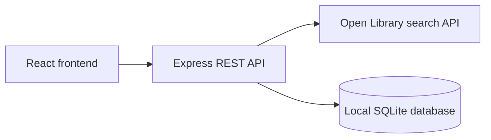

# Reading List design

Approved with the implementation plan on 2026-10-06. This records the agreed
scope and reasoning. The [README](../../../README.md) describes the current app;
the [checklist](../../assessment-checklist.md) records checks and pending handoff.

## Goal and scope

A small app to discover books and keep one personal reading list. Reviewers
should be able to follow the README, search/save/view/edit/remove, and restart
without losing saved data. The candidate must explain the code and tradeoffs
in a 15-minute presentation and 15-minute Q&A.

Use React, TypeScript, Node/Express and SQLite. Vite handles frontend development
and builds; TypeScript checks types and ESLint checks code. The planned minimum
is Node 24.12 and TypeScript 5.8. Use Node's type stripping, SQLite driver and
test runner to avoid extra tools. Verify the minimum runtime and disclose the
SQLite driver's stability there. Implementation pins TypeScript 6.0.3.

The brief suggests 4-6 hours including checks and handoff. Tests and paging are
selected extras; cache and CI depend on remaining time. Login, multiple users,
Docker and hosting are deferred. Requirements are in the checklist.

## Structure

| Location                       | Responsibility                                                             |
| ------------------------------ | -------------------------------------------------------------------------- |
| `client/`                      | React UI, backend requests and CSS                                         |
| `server/app.ts`                | App setup, API fallback and central HTTP errors; accepts test dependencies |
| `server/books/routes.ts`       | Search and saved-list endpoints                                            |
| `server/books/validation.ts`   | Parse inputs with shared schemas                                           |
| `server/books/open-library.ts` | External requests, normalization, timeout and optional cache               |
| `server/books/store.ts`        | Schema setup, prepared CRUD and row mapping                                |
| `server/index.ts`              | Config, database path, listener, static files and shutdown                 |
| `shared/books.ts`              | Statuses, schemas and derived input/response types                         |
| Colocated tests                | Temporary database/listener and controlled external responses              |

Vite forwards `/api` during development. Express serves the built frontend and
API together. Only the backend requests Open Library; title, author and year
provide useful details without cover images. No generic service/repository
framework is needed.

## Node and TypeScript choices

Selected [Tao of Node](https://alexkondov.com/tao-of-node/) guidance: group by
feature, keep HTTP handlers short, validate inputs, centralize errors and use
functions with explicit dependencies. Validate config at startup, use structured
diagnostics and shut down cleanly. Pin versions and the lockfile for `npm ci`.
Storage returns app objects; SQL names and JSON parsing stay inside the store.

Synchronous prepared SQL suits short local operations but blocks the event loop.
Document that limit. A query builder, containers and API versioning can wait for
a concrete need; this design does not adopt every recommendation from the article.

Use separate strict configs: JSX/bundler resolution for the client, NodeNext and
`erasableSyntaxOnly` for the server. Both include shared schemas. Run both
`tsc --noEmit` checks; Vite and Node execution do not replace type checking.
Server/tests use `.ts`, React uses `.tsx`, relative imports have explicit
extensions and type-only imports use `import type`. Avoid runtime enums,
decorators and parameter properties. No extra TypeScript runner or backend
bundler is needed.

Zod validates unknown JSON and supplies types through `z.infer`. Use the same
schemas for frontend responses instead of asserting arbitrary JSON is a book.
Runtime validation, static checks and database constraints protect different
boundaries.

Apply the relevant [TypeScript handbook rules](https://www.typescriptlang.org/docs/handbook/declaration-files/do-s-and-don-ts.html):
primitive types, `unknown` for untrusted data, simple unions, useful generic
parameters and honest optional callback arguments. Use `void` when return values
are ignored. The page is about declarations; no custom `.d.ts` system is needed.
Prefer inference locally and small explicit module contracts. Do not suppress
compiler errors or add unchecked casts to pass a check.

## Local template reference

The supplied TypeScript API template was reviewed without changing it. Useful
patterns were strict NodeNext/noEmit, `.ts` imports, native tests, a fixed upstream
origin, encoded parameters and unknown-JSON checks. Keep book-specific modules
instead of generic `api/`, `const/` and `utils/` layers; Zod replaces repeated guards.

A controlled fetch check found an inverted `response.ok` condition: valid 200
responses threw, while a schema-valid 404 body was returned. The template's shape
test did not cover HTTP behavior. Do not copy that condition. Test success and
failure statuses in the adapter. Explicit paged search needs neither automatic
retries nor bulk cursor loading.

## Data and integrity

One `saved_books` table stores a non-reused integer ID, unique Open Library work
ID, title, authors as JSON text, optional first publication year, status, notes
and UTC creation/update times. Metadata is a snapshot at save time.
New books start with `want_to_read` and empty notes. Other statuses are `reading`
and `finished`.

Use parameterized SQL, NOT NULL, uniqueness, length/status constraints, WAL
journaling, full synchronous durability and a bounded busy timeout. Each write
is one atomic statement. Use a transaction for dependent multi-write operations,
including legacy upgrades. Do not weaken durability for tests. Check rejected
writes and closing/reopening the same file. SQLite supplies transaction guarantees;
the app validates requests and maps errors to HTTP responses.

Store the file under a configurable project-relative data directory and exclude
it from Git. Assume one user/process. Higher load or hosted use needs a fresh
storage/deployment decision.

## HTTP contract

JSON responses; errors use `{error: "Readable message"}`.

| Endpoint                         | Success/input                                                                                  | Failures                                                                  |
| -------------------------------- | ---------------------------------------------------------------------------------------------- | ------------------------------------------------------------------------- |
| `GET /api/search?q=...&page=...` | 200 `{results,page,pageSize:12,total}`; trimmed query 1-200 characters; page 1-1000, default 1 | 400 invalid input, 502 upstream/status/data/network failure, 504 deadline |
| `GET /api/books`                 | 200 saved list, newest first                                                                   | 500 unexpected storage error                                              |
| `POST /api/books`                | Validated metadata; 201 saved item                                                             | 400 invalid input, 409 duplicate work                                     |
| `PATCH /api/books/:id`           | At least one of status/notes; 200 updated item                                                 | 400 invalid ID/body/fields, 404 missing item                              |
| `DELETE /api/books/:id`          | 204, empty body                                                                                | 400 invalid ID, 404 missing item                                          |

Unknown `/api` routes return JSON 404 before static serving. Missing assets
return 404, not successful HTML.

Search results and POST use `{workId,title,authors,firstPublishYear}`:

- Work ID matches `/works/OL<digits>W`.
- Title is nonblank, up to 300 characters.
- Authors: at most twenty nonblank strings, each up to 200 characters.
  An empty array means unknown authors.
- Year: null or integer 0-9999.

PATCH only accepts status and notes. Notes can be empty, up to 2000 characters.
Saved responses add `id`, `status`, `notes`, `createdAt` and `updatedAt`.
Order by creation time descending, then ID descending.

Reject invalid/noncanonical IDs, malformed JSON, arrays instead of objects,
unknown fields and out-of-range values. Limit bodies to 16 KiB, with 413 for
larger ones. Render stored metadata as text. Unexpected errors return a generic
message; diagnostic details stay on the backend.

## External API and extras

Use the fixed Open Library search URL, encoded parameters, selected fields and
an eight-second fetch timeout. Identify the app and respect request spacing.
Validate response shape and work IDs; missing author/year gets a fallback.
Empty results are a successful list, not a failure.

Submit search explicitly. Previous/Next changes pages; new queries reset to one.
The optional cache stores only successful query/page results for 60 seconds,
up to 100 entries. Refetch expired entries and test expiry with an injected clock.
The cache is lost on restart and never replaces the saved-list database.

The optional CI job runs lockfile install, lint, both type checks, tests and
build. A workflow file alone is not proof of a passing remote run.

## UI and React guidance

Search results show title, author/year and Save. Saved items have status/notes
editing, explicit Save and Remove. Show loading, empty and nearby errors; retain
failed drafts. Disable conflicting writes and ignore old search responses.
Use labels, visible focus, keyboard access and responsive CSS.

Apply the useful [Vercel React guidance](https://github.com/vercel-labs/agent-skills/blob/main/skills/react-best-practices/AGENTS.md):

- Search and list loading/failures are independent.
- Derive membership/counts during render; use a Set for repeated work-ID lookups.
- Define components at module scope and pass dependencies directly.
- Handle actions in events; use effects for synchronization with proper cleanup.
- Use functional, immutable updates for state based on previous state.
- Use explicit empty/count conditions; avoid memoizing cheap expressions.

No SWR, Next.js/RSC, server actions or speculative chunk splitting is needed
for this Vite client. Add performance tools only for an observed problem.

## Checks and handoff

Write tests before the behavior they exercise. Cover CRUD, duplicates, invalid
inputs, missing IDs, malformed JSON, upstream failures/timeouts/empty results,
atomic rejected writes and restart persistence. Test paging/cache if added.
Verify real integration and React behavior in the browser.

Use adversarial-development's assessment checks: map every required row to code
and evidence, run the toolchain, reproduce README setup and inspect source/history.
One independent review suits this local app; a high-risk multi-critic process is
not needed. Commit real milestones and record unresolved limits honestly.

README covers setup/config, commands, structure, API/storage choices, assumptions,
limits and Codex's actual role. Prepare demo/Q&A notes without claiming personal
review or rehearsal has happened. Repo sharing, schedule and email remain separate
submission tasks.

## Later implementation notes

The UI now has separate Saved books and Discover books tabs. Saved rows open
with native disclosure and retain drafts while hidden. Saved search filters
by title/author and shows ten per page. The cache was added; CI remains an inactive
template because publishing permission was unavailable.

A real search page contained edition IDs under work paths. The adapter skips
invalid IDs, validates the rest and rejects a nonempty all-invalid page.
Totals stay upstream totals. Queue wait is outside the fetch deadline and
queued work is not bounded/cancelled. These local-use limits are in the README.

## References

- [Assessment checklist](../../assessment-checklist.md)
- [Open Library search](https://openlibrary.org/dev/docs/api/search)
- [Open Library API usage](https://openlibrary.org/developers/api)
- [Node SQLite](https://nodejs.org/api/sqlite.html)
- [SQLite transactions](https://www.sqlite.org/transactional.html)
- [Tao of Node](https://alexkondov.com/tao-of-node/)
- [TypeScript declaration guidance](https://www.typescriptlang.org/docs/handbook/declaration-files/do-s-and-don-ts.html)
- [TypeScript strict checking](https://www.typescriptlang.org/tsconfig/strict.html)
- [Node TypeScript execution](https://nodejs.org/api/typescript.html)
- [Zod validation and inferred types](https://zod.dev/basics)
- [Vercel React guidance](https://github.com/vercel-labs/agent-skills/blob/main/skills/react-best-practices/AGENTS.md)
